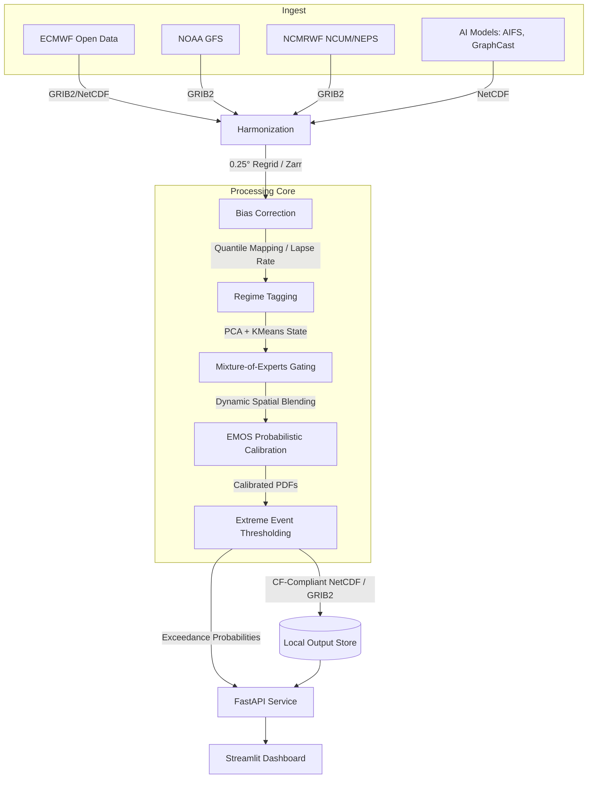

# System Architecture

Megha-Drishti operates a robust data engineering and machine learning pipeline to systematically ingest, harmonize, bias-correct, dynamically blend, and calibrate numerical and AI-based weather forecasts.

## Data Flow Diagram

## Key Modules

1. **Harmonization (`src/nwpblend/harmonise/`)**: Maps diverse coordinate systems into a strict canonical 0.25° grid over the defined domain (default: India bounding box). Uses chunked Zarr arrays for out-of-core Dask processing.
2. **Bias Correction (`src/nwpblend/biascorrect/`)**: Removes systemic mean errors via 2m temperature lapse-rate shifts and empirical precipitation Quantile Mapping.
3. **Gating Network (`src/nwpblend/blend/gating.py`)**: A PyTorch-based neural network that learns spatial feature representations, combining current forecast discrepancies and historical trailing skill to output highly localized softmax weights.
4. **EMOS Calibration (`src/nwpblend/blend/emos.py`)**: Uses Ensemble Marginal Objective Smoothing (and a Hurdle model for rainfall) to constrain the variance of the ensemble into formal probabilistic bounds, minimizing the Continuous Ranked Probability Score (CRPS).
5. **FastAPI & Export (`src/nwpblend/api/`)**: Translates internal xarray objects into serialized JSON grids, REST-compliant endpoints, and CF-1.8 NetCDF4 packages.
